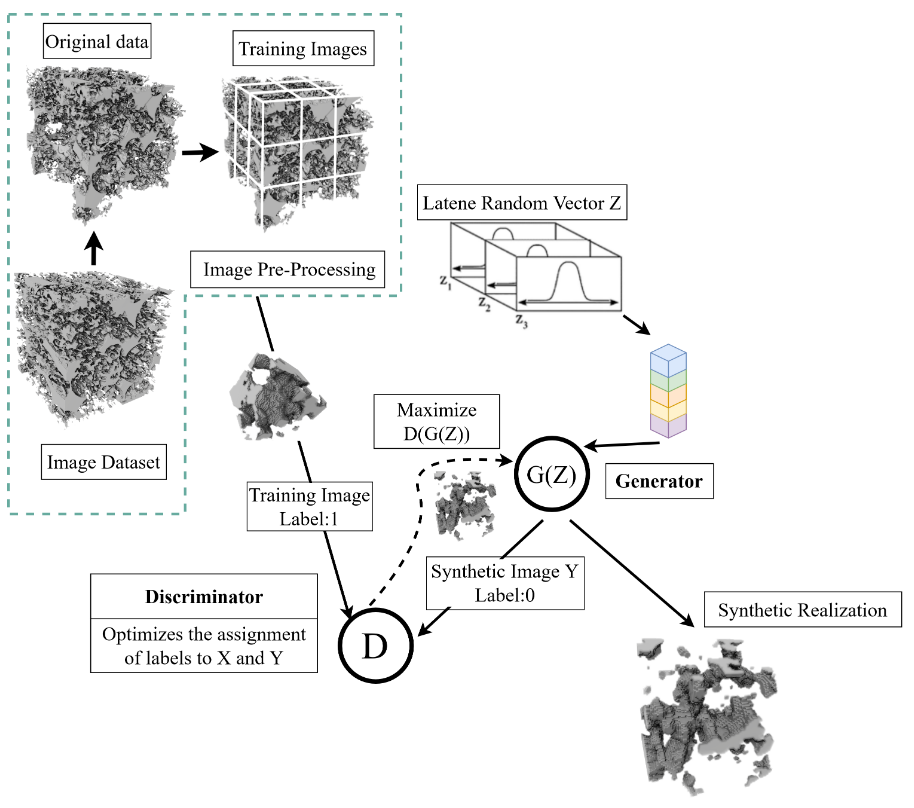

# DigitalRockConstruction

This is the official repository for "Multi-scale Reconstruction of 3D Digital Rock by Fusing Critical Information of Fine Scale with Framework of Large Scale: A Novel Approach". Please cite this work if you find this repository useful for your project.

The digital modeling of microstructure is crucial for investigating the physical and tra nsport properties of porous media. Multi-scale modeling of porous media can effectively c haracterize both coarse-scale and fine-scale information in high-resolution 3D pore structure
models with a large field of view (FoV). Currently, there is a lack of comprehensive fra mework studies on various subscale components that can be integrated with existing scales, such as micropor, mineral-clay, microcracks, etc. To tackle this issue, we propose a novel
framework that utilizes combinations of generative models. One of which focuses on pred icting coarse-scale structures, while another network fills in fine-scale information to gener ate combinate-scale structures. In the first network, WGAN is selected as basic training ne twork, inputing 3D noises into the generative network and producing images of coarse-scal e as output under the supervision of an adversarial network. We make a datasets designed
for the adversarial network which only contains coarse-scale images. The other generative network is built for being injected fine-scale information into the coarse-scale 3D images generated through the first generator. During the process, we input two-dimensional high-r
esolution imageswith fine-scale information into the discriminator to generate a multi-scale images. Taking anisotropy into consideration, loss function combinations are presented to d eal with. We conduct a case study on a multi-scale digital rock reconstructed of intra-grai n pores into inter-grain pores through our approach. Through qualitative and quantitative c omparison, it is demonstrated that our method is more practical and efficient than the late st numerical reconstruction methods.


<table>
  <tr>
    <td colspan="2" align="center">
      
      <br/>Figure 1: Network overview.
    </td>
  </tr>
  <tr>
    <td colspan="2" align="center">
      
      <br/>Figure 2: Our results.
    </td>
  </tr>
  <tr>
    <td align="center"></td>
    <td align="center"></td>
  </tr>
</table>


## Prerequisites

- Python 3.8
- PyTorch 1.12.0 + cu113 
- NVIDIA GPU + CUDA cuDNN

## Installation

- Clone this repo:

  ```
  git clone https://github.com/always258/rock.git
  ```

- Install PyTorch and dependencies from [http://pytorch.org](http://pytorch.org/)

- Install python requirements:

  ```
  pip install -r requirements.txt
  ```

## Started


###   Coarse scale 3D reconstruction

1、First, we need to remove the fine-scale structure from data that has both coarse-scale and fine-scale.


2、Run the code CRockGAN.py for training and generating coarse-scale 3D structures. The address is as follows "./Coarse-scale-3D-reconstruction/rockgan/CRockGAN.py"

```
python CRockGAN.py 
```


### Injecting fine-scale information in three dimensions

#### Trainting

To train the model on an anisotropic material with limited training data , run:

```
python code/Architecture.py -d rock --separator --anisotropic -phases_idx 1 -sf 4 -g_image_path lr75.tif -d_image_path hr32.tif hr32.tif hr6.tif
```


#### Testing

With the same directory name chosen for training. Specify for the size of the low-res volume to be super-resolved. There is no need to specify or here since only the generator is used. 
```
python code/Evaluation.py -d rock -phases_idx 1 -sf 4 -volume_size_to_evaluate 156 75 75 -g_image_path lr75.ti
```


## Example
Below is a display of some of our results, the original images and results can be viewed in the file ``` /img_folder/example/ ```.


## Acknowledgements

We would like to thank [WGAN-GP](https://github.com/ChenKaiXuSan/WGAN-GP-PyTorch.git), and [SliceGAN](https://github.com/stke9/SliceGAN.git).

If we missed a contribution, please contact us.
